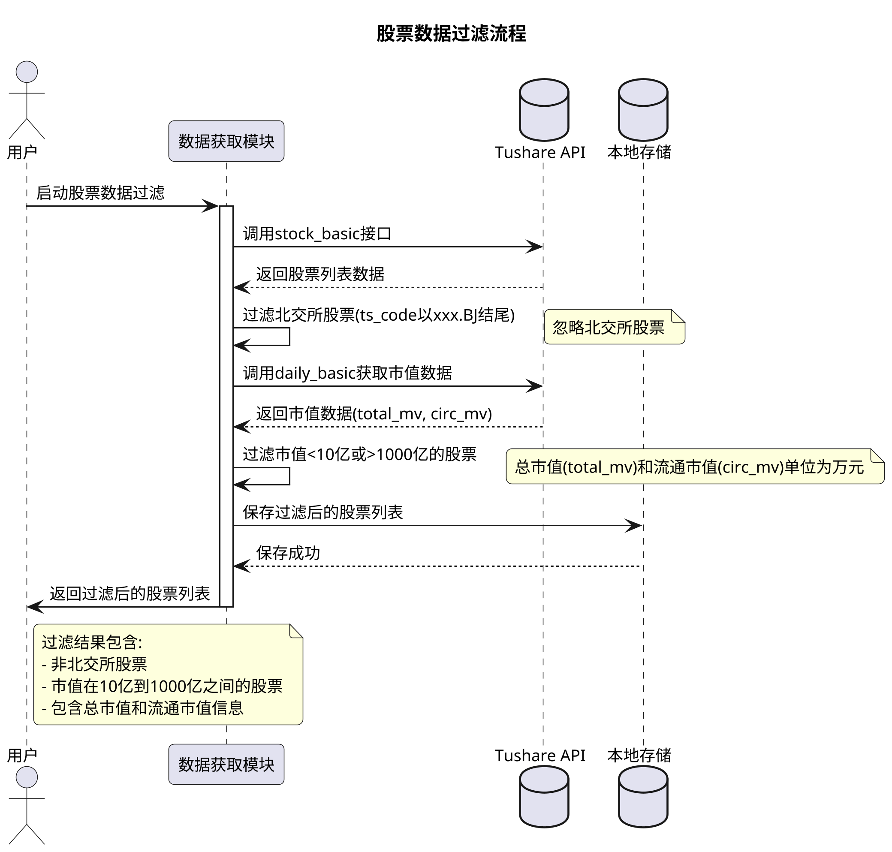
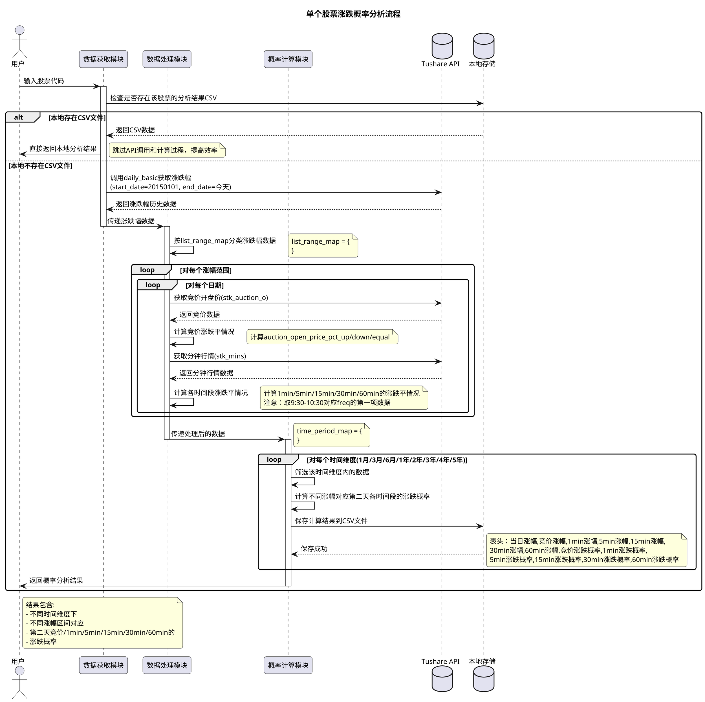

请帮我实现一下接口能力, 使用 uvicorn 作为服务提供 任务如下

# REST API 接口

## 获取所有股票列表



## 获取股票涨跌幅数据



### 额外补充描述

!!! 目标 输入某一个股票, 以及涨幅价格， 返回 近 1 月 3 月 6 月 1 年 2 年 3 年 4 年 5 年不同时间维度， 对应是[微涨 涨幅 < 1% , 小涨 涨幅 < 3% , 中涨 涨幅 < 5% , 大涨 涨幅 < 7% , 涨停 涨幅 >= 7% 平开 涨幅 = 0% 小跌 跌幅 < -1% , 中跌 跌幅 < -3% , 大跌 跌幅 < -5% , 跌停 跌幅 >= -5%]的概率。
!!! 在 前一天涨幅 单位 %, 第二天不同情况的是涨的概率， 数据维度以 近 1 月 3 月 6 月 1 年 2 年 3 年 4 年 5 年不同时间维度， 对应是涨的概率。

```
time_period_map = {
    'm1': '近1月',
    'm3': '3月',
    'm6': '6月',
    'y1': '1年',
    'y2': '2年',
    'y3': '3年',
    'y4': '4年',
    'y5': '5年'
    //.... 最多 10 年
}

```

[1-3][3-5] [5-7] [7-9] [10-19][涨停].
[1-3][3-5] [5-7] [7-9] [10-19][涨停] 对应变量 map 为
list_range_map = {
'range_1_3p': '1-3',
'range_3_5p': '3-5',
'range_5_7p': '5-7',
'range_7_9p': '7-9',
'range_10_19p': '10-19',
'limit_up': '涨停'
}
1.1 第二天 竞价开盘 涨幅情况。
1.2 计算 1min, 5min, 15min, 30min 的 最高价 最低价
1.3 返回对应 是涨的 还是跌的，以及开盘后 1min, 5min, 15min, 30min 的 涨幅概率

```
time_period_map = {
    // 竞价, key 为 竞价开盘价, 竞价在程序语言英文一般是 `auction`
    'auction': '竞价',
    '1min': '1分钟',
    '5min': '5分钟',
    '15min': '15分钟',
    '30min': '30分钟',
    '60min': '1小时',
}
```

## 流程

1. 获取所有股票列表 [接口 stock_basic]
2. [循环股票列表]过滤掉市值 小于 10 亿 以及 市值大于 1000 亿 的股票

   2.1 忽略 北交所 的股票 ts_code 以 `xxx.BJ`结尾。
   2.2 通过 接口 daily_basic 获取市值
   2.2.1 注意 总市值 是 `total_mv` 流通市值是 `circ_mv`，单位是万元
   2.2.2 过滤掉市值 小于 10 亿 以及 市值大于 1000 亿 的股票
   2.2.3 需要保留改股票对应 总市值 和 流通市值，后面可能需要用到

3. 通过每日指标 [接口 daily_basic]， 获取某股票单日的 涨跌幅
   3.1 以今天为 end_date, start_date 为 20150101
   3.2 返回的批量数据按以下流程处理
   3.2.1 按照这个 list_range_map 的 key 进行分类
   3.2.2 key 为 list_range_map 的 key, value 是一个 列表, 列表内容是 daily_basic 返回值 这里简记记为 daily_basic_pct

4. 统计不同时间维度, 第二天不同时间段 涨幅概率
   4.1 遍历该股票的 list_range_map
   4.2 获取该股票的 list_range_map 的 key 对应的日期列表
   4.3 遍历对应的列表
   4.3.1 获取该日期[daily_basic_pct.trade_date] 该股票的 竞价开盘价[接口 stk_auction_o] 记为 `auction_open_price`
   4.3.1.1 计算是涨还是跌还是平开 通过 竞价开盘价 auction_open_price.open 和前一天的 收盘价[daily_basic_pct.close] 计算
   4.3.1.2 计算的涨还是跌还是平开三种结果 扩展到 daily_basic_pct 中 [key] 取名 `auction_open_price_pct_up` `auction_open_price_pct_down` `auction_open_price_pct_equal`
   4.3.2 获取该日期[daily_basic_pct.trade_date] 该股票的历史分钟行情[接口 stk_mins] 按照 分钟频度（1min/5min/15min/30min/60min）
   记为 `mins_high_price_1min` `mins_high_price_5min` `mins_high_price_15min` `mins_high_price_30min` `mins_high_price_60min`
   4.3.2.1 类似竞价计算一样，计算是涨还是跌还是持平 通过 收盘价[mins_high_price_1min.close] 与改股票的前一天的 收盘价[daily_basic_pct.close] 计算 [注意: 只取第一项]
   4.3.2.2 计算的结果 扩展到 daily_basic_pct 中 [key] 取名 `mins_high_price_1min_pct_up` `mins_high_price_1min_pct_down` `mins_high_price_1min_pct_equal`
   4.3.2.3 类似竞价计算一样，计算是涨还是跌还是持平 通过 收盘价[mins_high_price_5min.close] 与改股票的前一天的 收盘价[daily_basic_pct.close] 计算 [注意: 只取第一项]
   4.3.2.4 计算的结果 扩展到 daily_basic_pct 中 [key] 取名 `mins_high_price_5min_pct_up` `mins_high_price_5min_pct_down` `mins_high_price_5min_pct_equal`
   4.3.2.5 类似竞价计算一样，计算是涨还是跌还是持平 通过 收盘价[mins_high_price_15min.close] 与改股票的前一天的 收盘价[daily_basic_pct.close] 计算 [注意: 只取第一项]
   4.3.2.6 计算的结果 扩展到 daily_basic_pct 中 [key] 取名 `mins_high_price_15min_pct_up` `mins_high_price_15min_pct_down` `mins_high_price_15min_pct_equal`
   //.... 最终计算 到 60min
5. 计算 time_period_map 时间维度下， 不同涨幅 对应第二天不同情况下[竞价，1min, 5min, 15min, 30min, 60min] 的涨跌概率
   5.1 计算近 1 个月维度
   5.1.1 先获取最近一个的 trade_date 的 daily_basic_pct 数据
   5.1.2 然后计算 近 1 个月维度下， 不同涨幅 对应第二天不同情况下[竞价，1min, 5min, 15min, 30min, 60min] 的不同涨跌幅概率
   5.1.3 概率计算为 分为 微涨 涨幅 < 1% , 小涨 涨幅 < 3% , 中涨 涨幅 < 5% , 大涨 涨幅 < 7% , 涨停 涨幅 >= 7% 平开 涨幅 = 0% 小跌 跌幅 < -1% , 中跌 跌幅 < -3% , 大跌 跌幅 < -5% , 跌停 跌幅 >= -5%
   5.2 计算后的数据保存， 保存到 csv 文件中, 方便后续直接查询
   5.2 表头分别为: 当日涨幅, 竞价涨幅, 1min 涨幅, 5min 涨幅, 15min 涨幅, 30min 涨幅, 60min 涨幅, 竞价涨跌概率, 1min 涨跌概率, 5min 涨跌概率, 15min 涨跌概率, 30min 涨跌概率, 60min 涨跌概率
   5.2 计算近 3 个月维度
   //..。 时间获取不一样， 其他类似
   5.3 计算近 6 个月维度
   //..。 时间获取不一样， 其他类似
   5.4 计算近 1 年维度
   //..。 时间获取不一样， 其他类似
   5.5 计算近 2 年维度
   //..。 时间获取不一样， 其他类似
   5.6 计算近 3 年维度
   //..。 时间获取不一样， 其他类似
   5.7 计算近 4 年维度
   //..。 时间获取不一样， 其他类似

## api doc 接口文档

### 获取 竞价开盘数据: https://tushare.pro/document/2?doc_id=353

```text
接口：stk_auction_o
描述：股票开盘9:30集合竞价数据，每天盘后更新
限量：单次请求最大返回10000行数据，可根据日期循环
权限：开通了股票分钟权限后可获得本接口权限，具体参考权限说明


输入参数

名称	类型	必选	描述
ts_code	str	N	股票代码
trade_date	str	N	交易日期(YYYYMMDD)
start_date	str	N	开始日期(YYYYMMDD)
end_date	str	N	结束日期(YYYYMMDD)


输出参数

名称	类型	默认显示	描述
ts_code	str	Y	股票代码
trade_date	str	Y	交易日期
close	float	Y	开盘集合竞价收盘价
open	float	Y	开盘集合竞价开盘价
high	float	Y	开盘集合竞价最高价
low	float	Y	开盘集合竞价最低价
vol	float	Y	开盘集合竞价成交量
amount	float	Y	开盘集合竞价成交额
vwap	float	Y	开盘集合竞价均价
接口用法


pro = ts.pro_api()

df=pro.stk_auction_o(trade_date='20241122')
```

### 股票历史分钟行情

```text
接口：stk_mins
描述：获取A股分钟数据，支持1min/5min/15min/30min/60min行情，提供Python SDK和 http Restful API两种方式
限量：单次最大8000行数据，可以通过股票代码和时间循环获取，本接口可以提供超过10年历史分钟数据。
权限：120积分可以调取2次接口查看数据，正式权限请参阅 权限说明 。


输入参数

名称	类型	必选	描述
ts_code	str	Y	股票代码，e.g. 600000.SH
freq	str	Y	分钟频度（1min/5min/15min/30min/60min）
start_date	datetime	N	开始日期 格式：2023-08-25 09:00:00
end_date	datetime	N	结束时间 格式：2023-08-25 19:00:00


freq参数说明

freq	说明
1min	1分钟
5min	5分钟
15min	15分钟
30min	30分钟
60min	60分钟


输出参数

名称	类型	默认显示	描述
ts_code	str	Y	股票代码
trade_time	str	Y	交易时间
open	float	Y	开盘价
close	float	Y	收盘价
high	float	Y	最高价
low	float	Y	最低价
vol	int	Y	成交量
amount	float	Y	成交金额
```

### 股本情况（盘前）

```text
接口：stk_premarket
描述：每日开盘前获取当日股票的股本情况，包括总股本和流通股本，涨跌停价格等。
限量：单次最大8000条数据，可循环提取
权限：与积分无关，需单独开权限


输入参数

名称	类型	必选	描述
ts_code	str	N	股票代码
trade_date	str	N	交易日期(YYYYMMDD格式，下同)
start_date	str	N	开始日期
end_date	str	N	结束日期


输出参数

名称	类型	默认显示	描述
trade_date	str	Y	交易日期
ts_code	str	Y	TS股票代码
total_share	float	Y	总股本（万股）
float_share	float	Y	流通股本（万股）
pre_close	float	Y	昨日收盘价
up_limit	float	Y	今日涨停价
down_limit	float	Y	今日跌停价


接口示例


pro = ts.pro_api()

#获取某一日盘前所有股票当日的最新股本
df = pro.stk_premarket(trade_date='20240603')
```

### 获取所有股票列表

```text
接口：stock_basic，可以通过数据工具调试和查看数据
描述：获取基础信息数据，包括股票代码、名称、上市日期、退市日期等
权限：2000积分起。此接口是基础信息，调取一次就可以拉取完，建议保存倒本地存储后使用

输入参数

名称	类型	必选	描述
ts_code	str	N	TS股票代码
name	str	N	名称
market	str	N	市场类别 （主板/创业板/科创板/CDR/北交所）
list_status	str	N	上市状态 L上市 D退市 P暂停上市，默认是L
exchange	str	N	交易所 SSE上交所 SZSE深交所 BSE北交所
is_hs	str	N	是否沪深港通标的，N否 H沪股通 S深股通
输出参数

名称	类型	默认显示	描述
ts_code	str	Y	TS代码
symbol	str	Y	股票代码
name	str	Y	股票名称
area	str	Y	地域
industry	str	Y	所属行业
fullname	str	N	股票全称
enname	str	N	英文全称
cnspell	str	Y	拼音缩写
market	str	Y	市场类型（主板/创业板/科创板/CDR）
exchange	str	N	交易所代码
curr_type	str	N	交易货币
list_status	str	N	上市状态 L上市 D退市 P暂停上市
list_date	str	Y	上市日期
delist_date	str	N	退市日期
is_hs	str	N	是否沪深港通标的，N否 H沪股通 S深股通
act_name	str	Y	实控人名称
act_ent_type	str	Y	实控人企业性质
说明：旧版上的PE/PB/股本等字段，请在行情接口"每日指标"中获取。

接口示例


pro = ts.pro_api()

#查询当前所有正常上市交易的股票列表

data = pro.stock_basic(exchange='', list_status='L', fields='ts_code,symbol,name,area,industry,list_date')

或者：

#查询当前所有正常上市交易的股票列表

data = pro.query('stock_basic', exchange='', list_status='L', fields='ts_code,symbol,name,area,industry,list_date')
```

### 每日指标

```text
接口：daily_basic，可以通过数据工具调试和查看数据。
更新时间：交易日每日15点～17点之间
描述：获取全部股票每日重要的基本面指标，可用于选股分析、报表展示等。
积分：至少2000积分才可以调取，5000积分无总量限制，具体请参阅积分获取办法

输入参数

名称	类型	必选	描述
ts_code	str	Y	股票代码（二选一）
trade_date	str	N	交易日期 （二选一）
start_date	str	N	开始日期(YYYYMMDD)
end_date	str	N	结束日期(YYYYMMDD)
注：日期都填YYYYMMDD格式，比如20181010

输出参数

名称	类型	描述
ts_code	str	TS股票代码
trade_date	str	交易日期
close	float	当日收盘价
turnover_rate	float	换手率（%）
turnover_rate_f	float	换手率（自由流通股）
volume_ratio	float	量比
pe	float	市盈率（总市值/净利润， 亏损的PE为空）
pe_ttm	float	市盈率（TTM，亏损的PE为空）
pb	float	市净率（总市值/净资产）
ps	float	市销率
ps_ttm	float	市销率（TTM）
dv_ratio	float	股息率 （%）
dv_ttm	float	股息率（TTM）（%）
total_share	float	总股本 （万股）
float_share	float	流通股本 （万股）
free_share	float	自由流通股本 （万）
total_mv	float	总市值 （万元）
circ_mv	float	流通市值（万元）
接口用法


pro = ts.pro_api()

df = pro.daily_basic(ts_code='', trade_date='20180726', fields='ts_code,trade_date,turnover_rate,volume_ratio,pe,pb')
或者


df = pro.query('daily_basic', ts_code='', trade_date='20180726',fields='ts_code,trade_date,turnover_rate,volume_ratio,pe,pb')
```

### A 股日线行情

````text
接口：daily，可以通过数据工具调试和查看数据
数据说明：交易日每天 15 点～ 16 点之间入库。本接口是未复权行情，停牌期间不提供数据
调取说明：120 积分每分钟内最多调取 500 次，每次 6000 条数据，相当于单次提取 23 年历史
描述：获取股票行情数据，或通过通用行情接口获取数据，包含了前后复权数据

输入参数

名称 类型 必选 描述
ts_code str N 股票代码（支持多个股票同时提取，逗号分隔）
trade_date str N 交易日期（YYYYMMDD）
start_date str N 开始日期(YYYYMMDD)
end_date str N 结束日期(YYYYMMDD)
注：日期都填 YYYYMMDD 格式，比如 20181010

输出参数

名称 类型 描述
ts_code str 股票代码
trade_date str 交易日期
open float 开盘价
high float 最高价
low float 最低价
close float 收盘价
pre_close float 昨收价【除权价，前复权】
change float 涨跌额
pct_chg float 涨跌幅 【基于除权后的昨收计算的涨跌幅：（今收-除权昨收）/除权昨收 】
vol float 成交量 （手）
amount float 成交额 （千元）
接口示例

pro = ts.pro_api()

df = pro.daily(ts_code='000001.SZ', start_date='20180701', end_date='20180718')

#多个股票
df = pro.daily(ts_code='000001.SZ,600000.SH', start_date='20180701', end_date='20180718')
或者

df = pro.query('daily', ts_code='000001.SZ', start_date='20180701', end_date='20180718')
也可以通过日期取历史某一天的全部历史

df = pro.daily(trade_date='20180810')
```s
````
